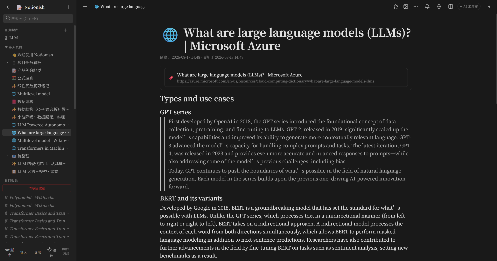

# 📝 Notionish — Notion 风格网页笔记

[](LICENSE)
[](https://github.com/MarkSUStech/notionish/stargazers)
[](https://github.com/MarkSUStech/notionish/issues)
[](js/)
[](#)
[](README.en.md)
[](https://marksustech.github.io/notionish/)

一个 **100% 运行在浏览器本地** 的 Notion 风格笔记应用，零前端依赖、无需安装，数据保存在浏览器本地（IndexedDB，支持大文件；localStorage 作为镜像）。可选的内置零依赖 Node 服务提供 AI 接入、代码编译运行与 MCP 桥接能力。

> 本仓库为本地优先的完整笔记应用：**离线可用、数据归你所有、可导出备份**。



## 🚀 快速开始

**方式一（最简单）**：直接用浏览器打开 `index.html`（双击即可，支持 `file://` 协议）。此模式下全部核心功能可用，仅 AI 接入、代码编译/运行与 MCP 桥接需要本地服务。

**方式二（推荐，本地服务器）**：
```bash
cd notionish
npx serve .
# 或 python -m http.server 8080
# 然后访问 http://localhost:3000 或 http://localhost:8080
```

**方式三（完整功能）**：启动内置零依赖运行服务：
```bash
cd notionish
node server.js
# 然后访问 http://127.0.0.1:8787
```
该服务会自动检测本机 `python`、`gcc/g++`、`javac/java` 编译器；未检测到时运行会提示。不运行代码时，用方式一/二打开即可正常编辑。

### 🌐 在线体验（GitHub Pages）

本项目前端零依赖，已可直接部署到 GitHub Pages：**https://marksustech.github.io/notionish/**

> 在线版数据保存在你自己的浏览器本地（IndexedDB），无需任何后端；AI 接入、代码编译/运行与 MCP 桥接需要本地 `node server.js`。

### 本地 MCP 浏览器桥接

使用 `node server.js` 打开 `http://127.0.0.1:8787` 后，顶栏会显示 **AI 已连接**。该页面会保留浏览器 `localStorage` 作为唯一数据源，同时通过本机 MCP 桥接向 AI 提供页面、块、数据库记录、题目、闪卡、模板和提醒的读写工具。

服务启动时会输出 MCP 地址和 Bearer token：

```text
MCP 端点: http://127.0.0.1:8787/mcp
MCP Bearer token: <启动时生成的随机值>
```

将 MCP 客户端配置为连接该地址，并在 `Authorization` 请求头中传入 `Bearer <token>`。页面必须保持打开；关闭页面或桥接断开时，写操作会在约 30 秒后返回超时错误。MCP 仅监听 `127.0.0.1`，不会访问任意本地文件或网络资源。

### AI 辅助模式（右侧助手面板）

顶栏的 **✦** 按钮（或 `Ctrl+Shift+A`）打开右侧 AI 助手。直接像聊天一样下达指令即可，AI 会自动调用「技能」完成操作：

- **写笔记**：说“帮我写一篇关于 X 的笔记”，AI 新建页面并写入结构化笔记。
- **补充笔记**：打开某页后说“补充一下这页”，AI 追加内容块。
- **编辑任意块**：AI 可直接新建/修改/删除/移动当前页的块，包括**表格、公式（LaTeX）、代码、待办、标题、列表**等。
- **出题 / 做闪卡**：说“给我出几道题”或“做几张闪卡”，AI 生成并写入题库/闪卡库。
- **调用本地技能（skills）**：AI 会扫描项目 `skills/` 目录下的 Claude Code / Codex 风格技能（`SKILL.md`），在需要时自动 `load_skill` 加载其完整说明并按其执行/扮演。
- **问答**：基于工作区笔记知识库回答（RAG 检索）。

所有写入操作都会先展示预览，你点「应用」后才真正写入；点「忽略」则丢弃。写入后自动增量更新索引。

- **检索（embedding）**：走 Ollama（可在本机或另一台机器上运行），默认 `http://127.0.0.1:11434`，模型 `nomic-embed-text`。
- **生成（LLM）**：走 OpenAI 兼容接口，需要 API Key。

首次使用点顶栏 **⚙** 打开「设置」页面，填写 AI 配置；`ai-config.json` 保存在项目目录（仅本机服务端读取），API Key 不会写入浏览器 `localStorage`。设置页还提供主题切换、AI 索引状态与重建、数据导出/导入。编辑笔记后会自动增量更新索引；也可点「🔄 重建索引」全量重建。

### 🔐 AI 配置与安全

AI 配置存放在项目根目录的 `ai-config.json`（由本地服务读取，浏览器端不可见）：

```json
{
  "ollamaUrl": "http://127.0.0.1:11434",
  "embedModel": "nomic-embed-text",
  "openaiBaseUrl": "https://api.deepseek.com",
  "openaiApiKey": "sk-xxxxxxxxxxxxxxxx",
  "openaiModel": "deepseek-chat"
}
```

> ⚠️ **安全提醒**：`ai-config.json` 包含你的真实 API Key，**已被本仓库 `.gitignore` 排除，切勿提交到任何公开仓库**。克隆本项目后请自行创建该文件（可复制 `ai-config.json.example`）并填入自己的密钥。

打开后会自动创建示例数据（欢迎页、任务看板数据库、功能对照表），可直接上手体验。

## ✨ 已实现的功能（对照 Notion）

### 1. 块编辑器
| 功能 | 说明 |
| --- | --- |
| 20+ 种块类型 | 正文、H1-H3 标题、无序/有序列表、待办、折叠列表、引用、提示框、分割线、代码块、图片、嵌入 iframe、书签、文件、表格、子页面、数据库引用 |
| 斜杠菜单 | 输入 `/` 弹出菜单，支持键盘上下键 + 回车选择，可输入关键字过滤 |
| Markdown 快捷输入 | `# ` `## ` `### ` `- ` `1. ` `[] ` `[x] ` `> ` ``` ` `--- ` 后按空格自动转换 |
| 富文本格式 | 加粗 / 斜体 / 下划线 / 删除线 / 行内代码 / 链接 / 10 种文字颜色 / 10 种背景色 |
| 浮动工具栏 | 选中文字自动弹出格式工具栏 |
| 键盘导航 | Enter 拆分块、行首 Backspace 合并/退级、Tab/Shift+Tab 缩进、方向键跨块移动 |
| 列表习惯 | 序号/圆点列表回车自动续号；空列表项 Backspace 先转为段落再合并，不会直接删行；列表内可用 / 呼出命令菜单 |
| 拖拽排序 | 悬停块左侧显示 ⋮⋮ 手柄，拖到目标块的上/下/内部进行排序与嵌套 |
| 块操作菜单 | 右键或 ⋯ 菜单：插入上/下方、转换为其他类型、上移下移、复制、删除、移至其他页面、复制块链接 |
| 图片/文件 | 上传、粘贴（Ctrl+V 截图直贴）、拖入文件均可，支持图片说明文字 |

### 2. 页面管理
- **无限嵌套**：页面下可建子页面，面包屑导航
- **侧边栏树**：展开/折叠、拖拽排序与移动、快捷新建子页面
- **收藏**：⭐ 收藏页面，侧边栏独立分组
- **回收站**：删除进回收站，可恢复或彻底删除（递归处理子页面）
- **页面图标**：2000+ emoji 选择器
- **封面**：12 种渐变封面或上传图片
- **复制/移动/重命名/导出**：页面菜单全支持

### 3. 数据库（六种视图 + 高级属性 + 筛选排序）
- **表格**：行=记录，列=属性，属性可直接编辑
- **看板**：按单选属性分组，卡片跨列拖拽即改分组
- **列表**：标题 + 预览 + 属性标签
- **画廊**：封面卡片式浏览
- **日历**：按日期属性排布，点日期新建记录
- **时间线**：甘特式横向排布，支持开始/结束日期，可配置日期属性
- **10 种属性类型**：文本、数字、单选、多选、日期、复选框、网址、**关联(Relation)**、**汇总(Rollup)**、**公式(Formula)**
- **公式属性**：内置安全公式引擎（无 eval），支持 `if / concat / round / floor / ceil / abs / max / min / length / empty / contains / lower / upper / trim / replace / toNumber / now` 与 `prop("属性名")` 引用
- **关联 + 汇总**：跨数据库关联记录，汇总支持求和/平均/计数/最值/去重/日期等
- **高级筛选 / 排序**：多条件 AND 筛选（按属性类型适配运算符）+ 多字段排序，对所有视图生效
- **属性管理**：添加/重命名/改类型/删除属性；单选多选属性可自由增删选项
- **记录管理**：新建、删除，点标题打开记录页（记录页是普通页面，可写任意内容）

### 4. LaTeX 公式（Obsidian 式，源码即文本）
- **行内公式 `$...$`**：输入 `$E=mc^2$` 自动渲染；**点击公式即显示 `$...$` 源码**，可直接在 `$...$` 内修改，Enter / Esc / 点击别处后重新渲染
- **行间公式 `$$...$$`**：闭合 `$$` 时**不立即渲染**，回车（换行）后才渲染成居中公式块；在 `$$...$$` 后面继续输入会自动换行到下一行；点击公式块在 textarea 里编辑 `$$...$$` 源码
- **渲染引擎**：优先 KaTeX（CDN）；离线降级为内置递归下降渲染器（嵌套分数、n 次根、矩阵、上下标、重音、希腊字母、\text 等）
- **斜杠菜单**：`/ 公式`（行间）、`/ 行内公式`（光标处插入）—— 在列表、引用、提示框、标题等所有文本块中均可用
- **渲染引擎**：优先使用 KaTeX（从 CDN 加载，支持 `\frac`、`\sqrt`、矩阵、希腊字母、求和积分等全部 LaTeX 语法）；离线时自动降级为内置轻量渲染器（常用命令子集），联网后自动升级为完整渲染
- 公式块支持「转换为」其他块类型；文字中的公式在块内可整块删除

### 5. 搜索与数据
- **全文搜索**（Ctrl+K / Ctrl+P）：搜索页面标题、块内容、表格单元格，结果带高亮与面包屑，点块结果直接跳转定位
- **导出/导入**：整个工作区导出为 JSON，可随时导入合并恢复
- **多标签页同步**：其他标签页的修改自动同步（storage 事件）
- **自动保存**：所有编辑自动写入本地存储（IndexedDB 主存储 + localStorage 镜像），刷新不丢失

### 5. 其他
- **深色/浅色主题**（Ctrl+\\）
- 块级深链接：复制块链接后可在地址栏 `#页面ID-块ID` 直达
- 完全离线可用，无任何外部请求

### 6. 评论 / 提及 / 提醒
- **块级评论**：右键或 ⋯ 菜单 →「评论」，块上显示 💬 计数徽标
- **@ 提及**：输入 @ 弹出页面选择器，插入可点击的页面提及芯片
- **提醒**：页面菜单 →「设置提醒」；顶栏 🔔 查看/完成/删除，到期弹 toast（支持浏览器通知）

### 7. 模板 / 目录 / 面包屑块
- **模板按钮**：🧩 块，可拖入子块或「＋ 子项」添加内容，点「＋ 插入」一键复制插入
- **目录块**：自动列出页面内 H1-H3 标题，点击平滑滚动定位
- **面包屑块**：显示当前页面路径，上级可点击跳转

### 8. 版本历史 / 撤销重做
- **撤销/重做**：Ctrl+Z / Ctrl+Y（或 Ctrl+Shift+Z），按编辑批次撤销整个工作区
- **版本历史**：页面菜单 →「版本历史」，自动记录最近版本，可一键恢复

### 9. 导出
- **Markdown**：页面菜单 →「导出为 Markdown」，支持富文本/公式/表格/数据库
- **HTML**：导出为独立 HTML 文件
- **PDF**：页面菜单 →「打印 / 导出 PDF」（浏览器打印）

### 10. 代码文件（IDE 模式）
- **VS Code 风格布局**：活动栏、文件资源管理器、标签栏、行号编辑器、底部输出面板、状态栏（语言/行列号/编译器状态）
- **语法高亮**：关键字 / 字符串 / 注释 / 数字（Python / C / C++ / Java）
- **新建代码文件**：主页按钮、侧栏「＋」菜单、块内 `/代码文件` 均可新建
- **语言**：Python / C / C++ / Java，语言选择器随时切换
- **编辑器**：Consolas 优先的 IDE 专属等宽字体，`Tab` 缩进、`Ctrl+Enter` 运行、`Ctrl/⌘ + 滚轮` 缩放字号
- **输入辅助**：自动配对 `() [] {} \"\" '' `` `、选区包裹、右符号跳过、成对删除、花括号与 Python `:` 自动缩进
- **运行**：通过内置 `node server.js` 调用本机编译器；输出实时回显到输出面板，含退出码与耗时
- **多文件项目**：代码文件下可建子代码文件，运行顶层文件会把整个子树作为项目一起编译
- **自动检测编译器**：启动服务后自动检测 `python`、`gcc/g++`、`javac/java`；检测不到会提示
- **代码片段块**：普通笔记中可插入「代码片段」（`/代码片段`），内容独立可编辑，可关联一个代码文件并点击跳转

### 11. 图表与智能表格
- **Mermaid 图表块**：`/图表` 插入，等宽源码编辑，点「渲染」成功则用图替换编辑器，点击图回到编辑；失败显示原因不渲染
- **智能表格**：表格下方「＋ 行」「＋ 列」，行/列悬停 ✕ 删除；`Tab/Shift+Tab` 移动单元格、`Enter` 下移并在末行新增一行、`Shift+Enter` 单元格内换行；块菜单可切换表头

## ⌨️ 快捷键

| 快捷键 | 功能 |
| --- | --- |
| `Ctrl/⌘ + K` | 搜索 |
| `Ctrl/⌘ + N` | 新建页面 |
| `Ctrl/⌘ + B / I / U` | 加粗 / 斜体 / 下划线 |
| `Ctrl/⌘ + S` | 立即保存 |
| `Ctrl/⌘ + Z` / `Ctrl/⌘ + Y` | 撤销 / 重做 |
| `Ctrl/⌘ + \\` | 切换深色/浅色主题 |
| `/` | 块菜单 |
| `Tab` / `Shift+Tab` | 缩进 / 取消缩进 |
| `Enter` / `Shift+Enter` | 换行 / 软换行 |
| `Esc` | 关闭菜单 / 取消选中 |

## 📁 项目结构

```
├── index.html          入口
├── server.js           本地运行服务（编译/运行代码 + MCP + AI 代理，零依赖）
├── server-mcp.js       MCP 协议与浏览器桥接队列
├── server-ai.js        AI RAG 纯逻辑（分块/向量索引/检索）+ 配置与模型调用
├── css/styles.css      设计系统（含深浅主题）
└── js/
    ├── util.js         工具函数（DOM、模态框、emoji 等）
    ├── math.js         LaTeX 渲染（KaTeX + 离线兜底）
    ├── store.js        数据模型 + IndexedDB/localStorage 持久化 + 搜索
    ├── blocks.js       块注册表 + 渲染 + 富文本序列化
    ├── editor.js       块编辑器（键盘/菜单/拖拽/格式工具栏）
    ├── database.js     数据库五视图
    ├── ide.js          代码文件 IDE（编辑 + 运行）
    ├── sidebar.js      侧边栏页面树/收藏/回收站
    ├── bridge.js       浏览器端 MCP 执行层
    ├── ai.js           右侧 AI 助手面板（聊天/索引同步/出题/闪卡）
    ├── settings.js     设置页面（主题/AI 配置/索引/数据）
    └── app.js          路由、顶栏、快捷键、导入导出
```

## 🧪 测试

```bash
node smoke-test.js    # 无头冒烟测试：核心数据逻辑 + 桥接 + AI 助手纯逻辑
node server-test.js   # 运行服务纯逻辑 + MCP 队列 + 端到端（环境允许时）
node server-ai-test.js # AI RAG 纯逻辑（分块/余弦/索引/配置）
```

## ⚠️ 与 Notion 的差异（诚实说明）

- **无多人实时协作**：数据只在本机 localStorage，不跨设备
- 公式引擎为内置子集（无 Notion 全部函数、无嵌套公式组高级特性）
- 评论为单用户本地记录（无 @ 多人协作、无实时通知推送）
- 版本历史为「最近 10 版」粗粒度快照；撤销/重做为会话内（刷新后清空）
- 图片/PDF/文件以 base64 存于本地 IndexedDB（配额远大于 localStorage，可存较大文件）；仍建议定期导出备份。

## 💾 数据备份

左下角 **「导出」** 随时备份全部数据为 JSON；**「导入」** 可合并恢复。

## 🎨 主题定制

配色方案抽离为 `theme.json`（基础，含 `light` / `dark` 两套，覆盖 App 与 IDE 全部颜色 token 及语法高亮 token）。如需自定义，在同一目录放置 `theme.user.json`，对其做**深合并覆盖**即可，无需改代码：

```json
{ "light": { "accent": "#ff6b6b" }, "dark": { "accent": "#ff8a8a" } }
```

启动时自动加载并合并为 CSS 变量；`theme.user.json` 缺失时仅使用基础配色。文件由本地服务（`node server.js`）提供，`file://` 打开时因浏览器限制会回退到内置默认配色。

## 🧰 技术栈与依赖

- **前端**：原生 JavaScript（IIFE 模块 + 全局命名空间），零构建、零打包，无前端框架
- **后端**：Node.js 内置 `http` 模块（零 npm 依赖），fork 式子模块
- **存储**：IndexedDB（主） + localStorage（镜像）双写，多标签页自动同步
- **第三方库**（`vendor/` 目录，随仓库分发，均保留各自许可证）：
  - [KaTeX](https://github.com/KaTeX/KaTeX) — LaTeX 渲染
  - [Mermaid](https://github.com/mermaid-js/mermaid) — 图表渲染
  - [Mozilla Readability](https://github.com/mozilla/readability) — 网页正文提取
  - [Turndown](https://github.com/mixmark-io/turndown) — HTML 转 Markdown
  - [PDF.js](https://github.com/mozilla/pdf.js) — PDF 查看
  - [lucide](https://github.com/lucide-icons/lucide) — 图标

## 📄 许可证

[MIT](LICENSE) © 2025 Notionish 贡献者

本项目仅供学习交流。Notion 是 Notion Labs, Inc. 的商标，本项目与 Notion 无任何关联，功能实现为独立创作。
